# System Architecture

This document describes the current `local-slm` architecture as implemented in
`agent.py`, `fs_tools.py`, `ollama_client.py`, and `config.py`.

## 1. End-to-end system flow

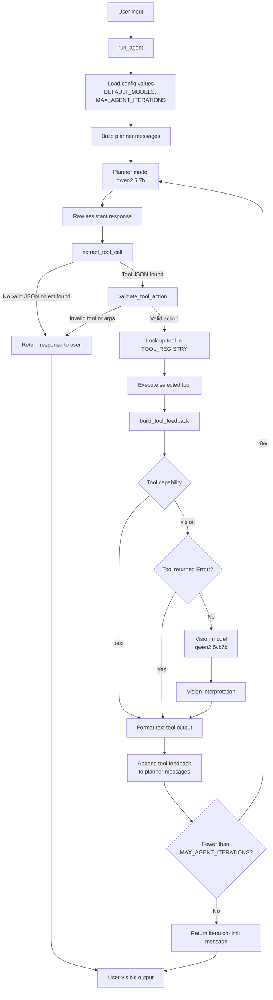

### Runtime sequence

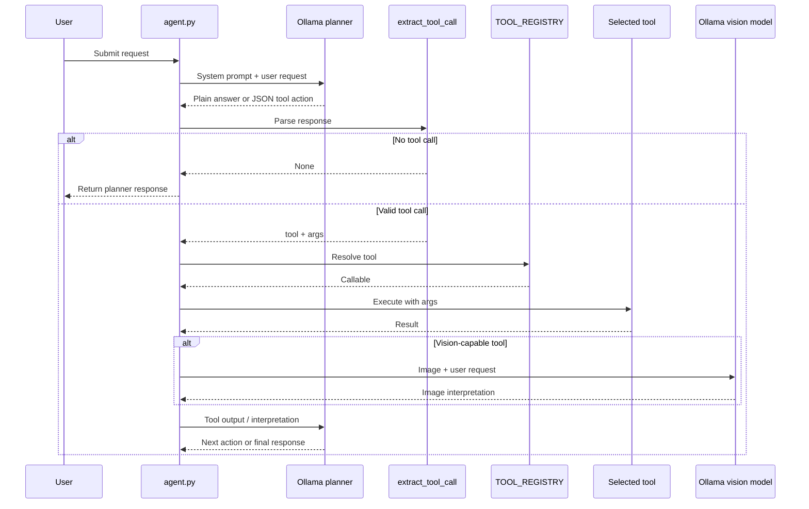

The loop is capped at five iterations to prevent an indefinitely repeating
planner/tool cycle.

## 2. Model and routing architecture

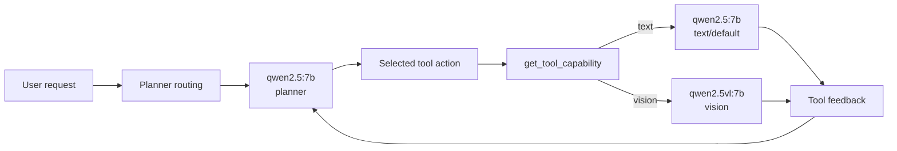

`get_model_for_capability` uses the requested capability's configured model.
If no model is configured for that capability, it falls back to the planner
model.

## 3. Tool registry and shared boundaries

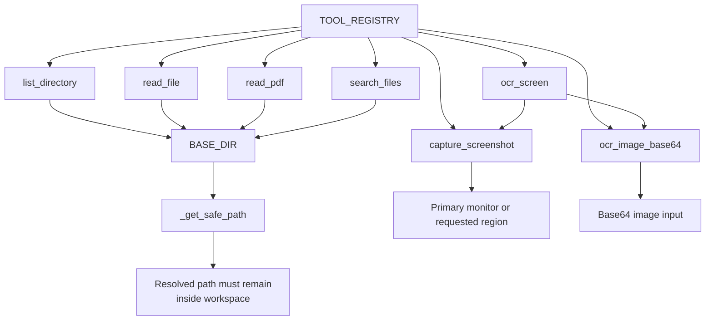

The filesystem tools share this workspace boundary:

```text
C:\Users\rmvilla\Documents\Books
```

`_get_safe_path` resolves the requested path and rejects paths that resolve
outside `BASE_DIR`.

## 4. Individual tool architectures

### 4.1 `list_directory`

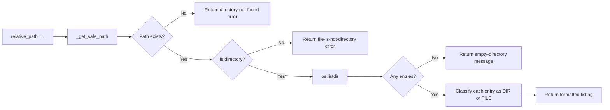

### 4.2 `read_file`

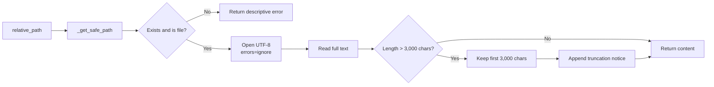

### 4.3 `read_pdf`

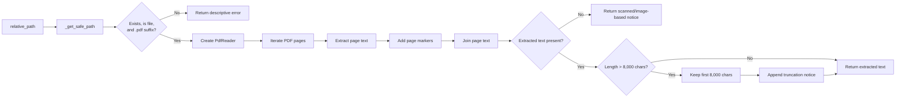

### 4.4 `search_files`

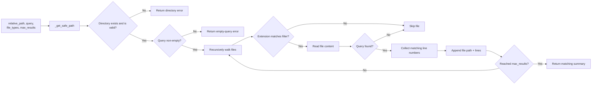

### 4.5 `capture_screenshot`

```mermaid
flowchart LR
    Input[region, scale, as_base64,<br/>jpg_quality] --> MSS[Open mss capture]
    MSS --> Monitor{Region supplied?}
    Monitor -->|No| Primary[Use primary monitor]
    Monitor -->|Yes| Custom[Build requested monitor rectangle]
    Primary --> Grab[Grab screen pixels]
    Custom --> Grab
    Grab --> Array[Convert MSS image to NumPy array]
    Array --> BGR[Convert BGRA to BGR with OpenCV]
    BGR --> Scale{0 < scale < 1?}
    Scale -->|Yes| Resize[Downscale with INTER_AREA]
    Scale -->|No| Encode[Encode as JPEG]
    Resize --> Encode
    Encode --> Success{Encoding succeeded?}
    Success -->|No| Error[Return encoding error]
    Success -->|Yes| Bytes[Get JPEG bytes]
    Bytes --> Format{as_base64?}
    Format -->|Yes| Base64[Base64-encode JPEG]
    Format -->|No| Raw[Return raw bytes]
```

### 4.6 `ocr_image_base64`

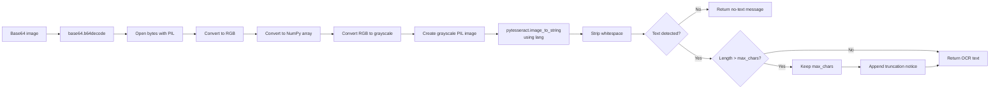

### 4.7 `ocr_screen`

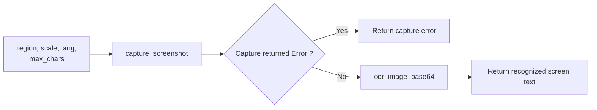

## 5. External runtime dependencies

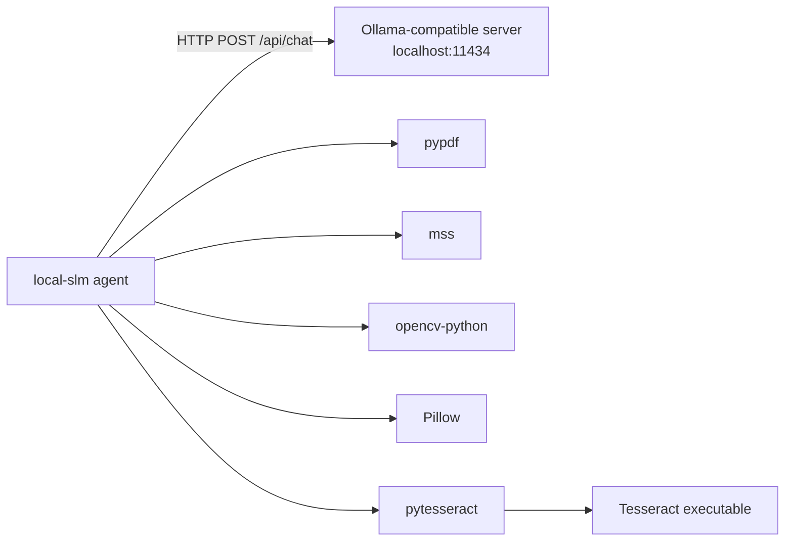

The Ollama server must provide the configured planner/text and vision models
(configurable via environment variables).

OCR additionally requires the Tesseract executable. The default location is:

```text
C:\Program Files\Tesseract-OCR\tesseract.exe
```

This can be overridden via the `TESSERACT_PATH` environment variable in `config.py`.

## 6. Configuration Management

All configuration values are centralized in `config.py` and can be overridden via environment variables:

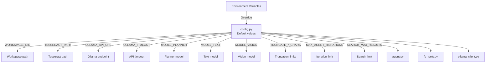

All defaults are defined in `config.py` and can be customized via environment variables without code changes.
